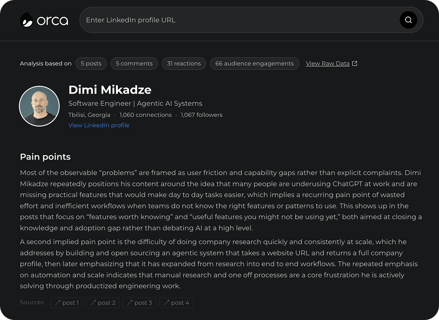

<p align="center">
  
</p>

<p align="center">AI agent for deep LinkedIn profile analysis.</p>

<div align="center">

[](LICENSE)
[](https://github.com/dimimikadze/orca/actions/workflows/ci.yml)
[](CONTRIBUTING.md)

</div>

Orca is an AI agent for deep LinkedIn profile analysis. You define the insights you care about, and Orca extracts them.

It scrapes posts, comments, reactions, and interaction networks, then reasons over the data autonomously to extract structured insights like pain points, current focus, values, expertise, network influence, communication style, and how interests change over time. It calls additional scraping tools on its own when it needs more data.

The core logic lives in orca-ai/ as a standalone library. You can plug it into any Node.js project and run it at scale.

**Use cases**

- Sales: understand a prospect's real priorities before outreach
- Recruiting: assess what a candidate actually cares about beyond their résumé
- Investing: map a founder's thinking and evaluate positioning
- Job seeking: research a hiring manager or employer before interviews

<p align="center">
  
</p>

## How it works

1. Provide a LinkedIn profile URL and define the insights you want to extract.
2. Orca scrapes the baseline data: profile, posts, comments, reactions, and top post engagement.
3. The agent reasons over the data and extracts structured insights. If it needs more data for a specific insight, it calls scraping tools autonomously.
4. Results stream back to the UI as the agent works.

## Tech Stack

- Next.js 16, TypeScript, Tailwind CSS
- LangChain (supports OpenAI, Anthropic, and other LLM providers)

## Requirements

- Node.js 20+, pnpm
- [Fresh LinkedIn Profile Data](https://rapidapi.com/freshdata-freshdata-default/api/fresh-linkedin-profile-data) API key
- API key for your LLM provider of choice (default: OpenAI)

## Environment Variables

Create `.env.local` in the project root:

```
RAPIDAPI_KEY=your_key
OPENAI_API_KEY=your_key
```

## Installation

```bash
git clone https://github.com/dimimikadze/orca.git
cd orca
pnpm install
pnpm dev
```

Open http://localhost:3000.

## Tests

All scrapers and the analysis agent are covered by tests. Each test can run against recorded fixtures (no live API needed) or against real LinkedIn data by setting `USE_LIVE_DATA = true` in the test file.

Dedicated test cases and all available test commands are in `package.json`.

## Contributing

See [CONTRIBUTING.md](./CONTRIBUTING.md) for guidelines.

## License

Distributed under the MIT License. See [LICENSE](./LICENSE) for details.
